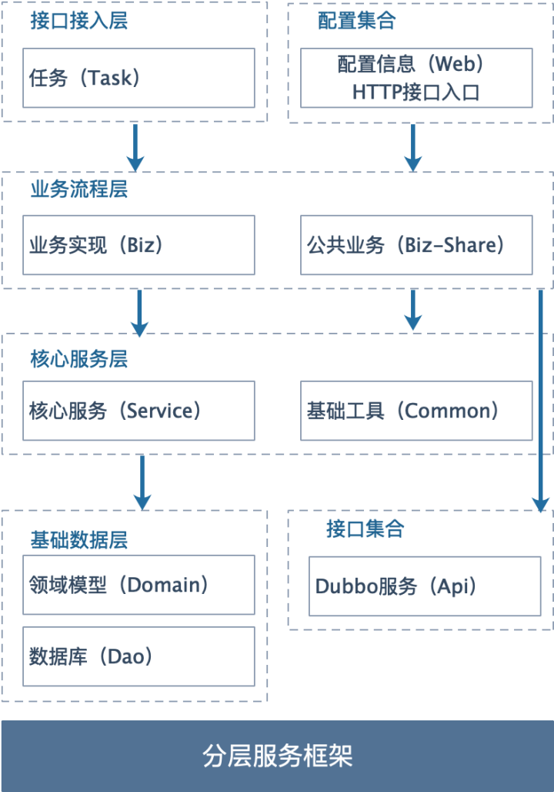
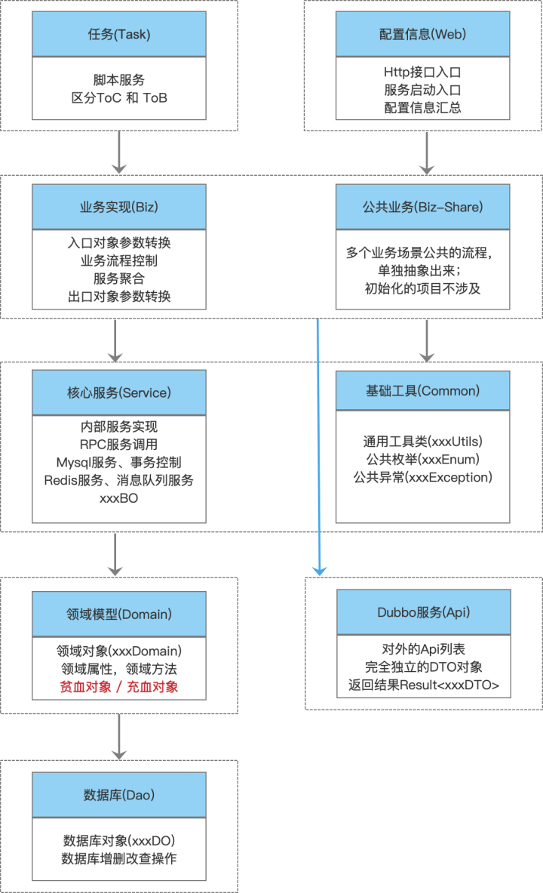

# 1.什么是ark-layer-framework？
&emsp;&emsp;什么是ark-layer-framework是ark系列框架中的分层框架1.0，类似cola框架。是一种应用架构， 
那什么是应用架构呢？应用架构就是要从繁杂的业务系统中提炼出共性，找到解决业务问题的最佳共同模式，为开发人员提供统一的认知，治理混乱。帮助应用系统“从混乱到有序”，分层框架架构就是为此而生，其核心职责就是定义良好的应用结构，提供最佳实践。

# 2.ark-layer-framework解决了什么问题？
&emsp;&emsp;相比较于传统的三层框架，分层框架1.0主要解决业务复杂性的问题，适用于复杂业务的场景。
 

 

# 3.ark-layer-framework的使用场景
- 分层框架，适用于业务比较复杂的项目使用，如中台项目
# 4.ark-layer-framework服务如何生成？
例子：创建my-demo项目，指定groupId、artifactId、version、package
 
mvn archetype:generate -DarchetypeGroupId=com.ark.layer -DarchetypeArtifactId=ark-layer-framework-archetype -DarchetypeVersion=1.0 -DgroupId=com.ark.demo -DartifactId=my-demo -Dversion=1.0 -Dpackage=com.ark.demo 

